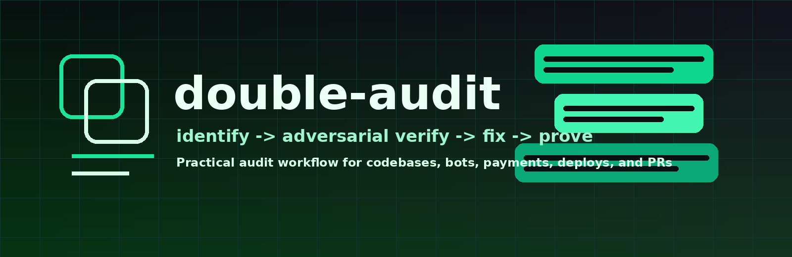

# double-audit

<p align="center">
  
</p>

A Claude skill for practical codebase, bot, payment, deploy, and security audits.

The idea behind it: one audit pass finds possible problems. The second pass tries to kill them. Anything that survives gets fixed, tested, documented, and shipped as a small reviewable PR.

This is not a generic "security checklist" skill. It is built for operator-style audits where the result should be a safer repo, not a PDF full of hypotheticals.

## Contents

- `SKILL.md`: the skill itself. It runs in four modes: AUDIT ONLY, AUDIT AND FIX, PR REVIEW, and POST-FIX SECURITY POSTURE.
- `references/audit-playbook.md`: detailed checklists, command packs, finding taxonomy, PR body template, and examples from payment/bot/SQLite audits.
- `double-audit.skill`: the same two files packaged as a single zip for one-step install.

## What it audits well

- payment and billing flows
- referral and balance logic
- subscription state machines
- Telegram or Discord bots
- background workers and polling loops
- SQLite migrations and deploy scripts
- admin callbacks and privileged commands
- dependency and static-analysis posture
- PRs that need a security or launch-readiness review

## Install (Claude Code)

A skill is a folder that holds a `SKILL.md`. You want the file to end up at `~/.claude/skills/double-audit/SKILL.md`. Pick one of the methods below, then verify it loaded.

### Method 1: clone the repo

macOS and Linux:

```bash
git clone https://github.com/doxe0x/double-audit-skill.git ~/.claude/skills/double-audit
```

Windows (PowerShell):

```powershell
git clone https://github.com/doxe0x/double-audit-skill.git $env:USERPROFILE\.claude\skills\double-audit
```

Windows (cmd):

```cmd
git clone https://github.com/doxe0x/double-audit-skill.git %USERPROFILE%\.claude\skills\double-audit
```

Cloning also leaves `README.md`, `LICENSE`, `double-audit.skill`, and a `.git` folder in the skill directory. That is harmless, because Claude Code only reads `SKILL.md` and the `references` files.

If you want a clean copy with no git history, use degit instead:

```bash
npx degit doxe0x/double-audit-skill ~/.claude/skills/double-audit
```

### Method 2: unzip the bundle

Download `double-audit.skill` and unzip it into your skills folder. The archive already nests everything under a `double-audit/` folder, so you get the right layout.

macOS and Linux:

```bash
mkdir -p ~/.claude/skills
unzip double-audit.skill -d ~/.claude/skills/
```

Windows (PowerShell):

```powershell
Expand-Archive -Path double-audit.skill -DestinationPath $env:USERPROFILE\.claude\skills\
```

If your unzip tool refuses the `.skill` extension, rename the file to `double-audit.zip` first. It is a plain zip.

### Verify it loaded

Claude Code reads skills when a session starts, so open a new session or restart Claude Code after installing. Then run `/skills` and check that `double-audit` is listed.

If it is missing, make sure the file sits at exactly:

```text
~/.claude/skills/double-audit/SKILL.md
```

and not:

```text
~/.claude/skills/double-audit/double-audit/SKILL.md
```

Once it is loaded, Claude uses it on requests like:

- "audit this repo"
- "security review this bot"
- "continue fixing the problematic places"
- "what else should we fix before launch?"
- "review this PR for risk"
- "clean up the security posture"

### Install for one project only

To scope the skill to a single repo instead of your whole machine, put the same folder under that project:

```text
<project>/.claude/skills/double-audit/SKILL.md
```

Same layout, just under the project root instead of your home directory.

## Install (Claude app)

In the Claude web or desktop app, open Settings, find the Skills section, choose to upload a skill, and pick `double-audit.skill`. Upload the bundle as is. Do not unzip it; unzipping is only for the Claude Code method above.

If the upload dialog accepts only `.zip`, rename `double-audit.skill` to `double-audit.zip` first. Custom skills need a plan that has the skills feature turned on.

## Is it safe to run

This skill is plain instructions and reference text. It declares no tools, makes no network calls, runs no scripts, and reads nothing beyond the repo or text you ask Claude to inspect. The whole skill is `SKILL.md` plus `references/audit-playbook.md`, both plain text you can read before installing.

The skill may instruct Claude to run local audit commands such as tests, static analysis, or dependency scanners when you ask it to audit a repo. Those are normal Claude tool actions, not code bundled inside the skill.

## The one rule that overrides the rest

Do not report unverified risk as fact. If a finding is only plausible, label it as a hypothesis. If you fix something, prove it with tests or explain why it cannot be tested.

## Rebuilding the bundle

If you edit `SKILL.md` or `references/audit-playbook.md`, rebuild `double-audit.skill` so it stays in sync with the source. From inside the repo:

```bash
python3 - <<'PY'
from pathlib import Path
from zipfile import ZIP_DEFLATED, ZipFile
root = Path.cwd()
out = root / 'double-audit.skill'
with ZipFile(out, 'w', ZIP_DEFLATED) as z:
    z.write(root / 'SKILL.md', 'double-audit/SKILL.md')
    z.write(root / 'references/audit-playbook.md', 'double-audit/references/audit-playbook.md')
print(out)
PY
```

Then run:

```bash
unzip -l double-audit.skill
```

Confirm every path nests under a top-level `double-audit/` folder.

## License

MIT. See `LICENSE`.
