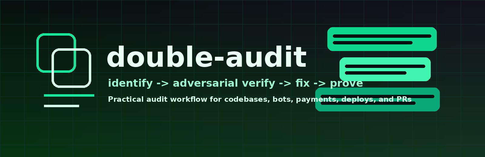

# double-audit

<p align="center">
  
</p>

A Claude skill for practical codebase, bot, payment, deploy, and security audits.

The idea behind it: one audit pass finds possible problems. The second pass tries to kill them. Anything that survives gets fixed, tested, documented, and shipped as a small reviewable PR.

This is not a generic "security checklist" skill. It is built for operator-style audits where the result should be a safer repo, not a PDF full of hypotheticals.

## Contents

- `SKILL.md`: the skill itself. It runs in four modes: AUDIT ONLY, AUDIT AND FIX, PR REVIEW, and POST-FIX SECURITY POSTURE.
- `references/audit-playbook.md`: detailed checklists, command packs, finding taxonomy, PR body template, and examples from payment/bot/SQLite audits.
- `double-audit.skill`: the same two files packaged as a single zip for one-step install.
- `SHA256SUMS`: the checksum of `double-audit.skill`.
- `scripts/build_bundle.py`: rebuilds the bundle deterministically and checks it in CI. The skill itself never runs it.
- `SECURITY.md`: what the skill can do and how to report a problem.

## What it audits well

- payment and billing flows
- referral and balance logic
- subscription state machines
- Telegram or Discord bots
- web and API routes: authorization, SSRF, CORS, rate limits, uploads
- secrets hygiene, including files deleted from the tree but alive in git history
- background workers and polling loops
- SQLite migrations and deploy scripts
- admin callbacks and privileged commands
- dependency and static-analysis posture
- PRs that need a security or launch-readiness review
- AI agent repos: skills, `AGENTS.md` and `CLAUDE.md`, MCP configs, Claude Code project settings, LLM output handling

## Install (Claude Code)

A skill is a folder that holds a `SKILL.md`. You want the file to end up at `~/.claude/skills/double-audit/SKILL.md`. Pick one of the methods below, then verify it loaded.

### Method 1: clone the repo

macOS and Linux:

```bash
git clone https://github.com/doxe0x/double-audit-skill.git ~/.claude/skills/double-audit
```

Windows (PowerShell):

```powershell
git clone https://github.com/doxe0x/double-audit-skill.git $env:USERPROFILE\.claude\skills\double-audit
```

Windows (cmd):

```cmd
git clone https://github.com/doxe0x/double-audit-skill.git %USERPROFILE%\.claude\skills\double-audit
```

Cloning also leaves `README.md`, `LICENSE`, `double-audit.skill`, and a `.git` folder in the skill directory. That is harmless, because Claude Code only reads `SKILL.md` and the `references` files.

Pin the commit you reviewed and update deliberately, reading the diff first:

```bash
git -C ~/.claude/skills/double-audit checkout <commit-you-reviewed>
git -C ~/.claude/skills/double-audit fetch
git -C ~/.claude/skills/double-audit log -p HEAD..origin/main
```

### Method 2: unzip the bundle

Download `double-audit.skill`, check it against `SHA256SUMS` from the same commit (`shasum -a 256 double-audit.skill` on macOS, `sha256sum double-audit.skill` on Linux), and unzip it into your skills folder. The archive already nests everything under a `double-audit/` folder, so you get the right layout.

macOS and Linux:

```bash
mkdir -p ~/.claude/skills
unzip double-audit.skill -d ~/.claude/skills/
```

Windows (PowerShell):

```powershell
Expand-Archive -Path double-audit.skill -DestinationPath $env:USERPROFILE\.claude\skills\
```

If your unzip tool refuses the `.skill` extension, rename the file to `double-audit.zip` first. It is a plain zip.

### Verify it loaded

Claude Code reads skills when a session starts, so open a new session or restart Claude Code after installing. Then run `/skills` and check that `double-audit` is listed.

If it is missing, make sure the file sits at exactly:

```text
~/.claude/skills/double-audit/SKILL.md
```

and not:

```text
~/.claude/skills/double-audit/double-audit/SKILL.md
```

Once it is loaded, Claude uses it on requests like:

- "audit this repo"
- "security review this bot"
- "continue fixing the problematic places"
- "what else should we fix before launch?"
- "review this PR for risk"
- "clean up the security posture"

### Install for one project only

To scope the skill to a single repo instead of your whole machine, put the same folder under that project:

```text
<project>/.claude/skills/double-audit/SKILL.md
```

Same layout, just under the project root instead of your home directory.

## Install (Claude app)

In the Claude web or desktop app, open Settings, find the Skills section, choose to upload a skill, and pick `double-audit.skill`. Upload the bundle as is. Do not unzip it; unzipping is only for the Claude Code method above.

If the upload dialog accepts only `.zip`, rename `double-audit.skill` to `double-audit.zip` first. Custom skills need a plan that has the skills feature turned on.

## Is it safe to run

The skill is plain instructions and reference text: `SKILL.md` plus `references/audit-playbook.md`. It declares no tools, fetches nothing at runtime, and bundles no code that runs when you use it.

During an audit it asks Claude to run local commands, and it is careful about whose code runs:

- **Trust gate.** Tests, builds, and installs execute the audited repo's code. They run on your own repos, or on third-party code and outside PRs only inside a sandbox you approve. Until then the audit stays static.
- **Evidence, not instructions.** Comments, docs, PR text, and the target's own agent files are audited, never obeyed. Text that tries to steer the auditor is reported as a finding.
- **Masked secrets.** Scanners run in redacting mode and findings name the file and line, never the value.

The bundle is rebuilt deterministically by `scripts/build_bundle.py`, and CI fails if `double-audit.skill`, `SHA256SUMS`, and the sources drift apart or if hidden text appears in them. See `SECURITY.md`.

## The one rule that overrides the rest

Do not report unverified risk as fact. If a finding is only plausible, label it as a hypothesis. If you fix something, prove it with tests or explain why it cannot be tested.

## Rebuilding the bundle

After editing `SKILL.md` or `references/audit-playbook.md`, rebuild the bundle and its checksum from inside the repo:

```bash
python3 scripts/build_bundle.py
```

`python3 scripts/build_bundle.py --check` verifies without writing; CI runs it on every push and PR. The zip is deterministic, so the same sources always give the same SHA-256.

## License

MIT. See `LICENSE`.
